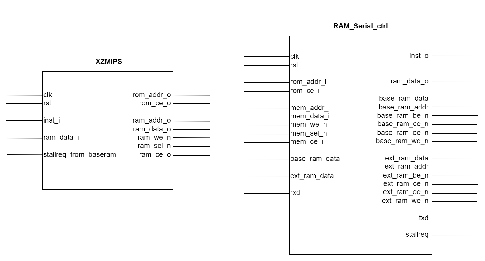
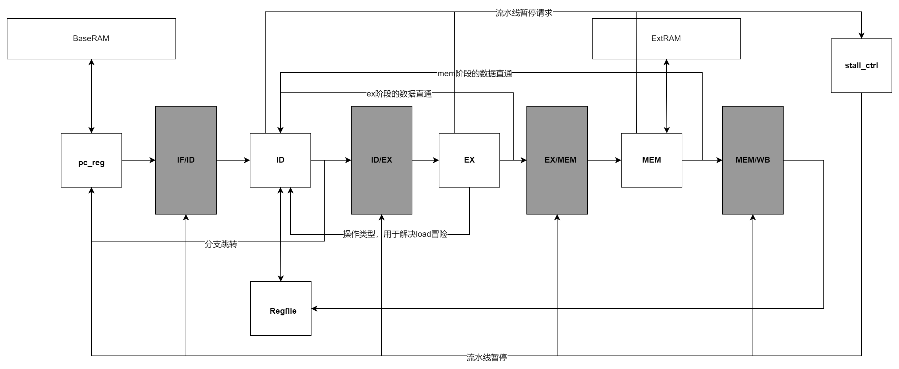

[TOC]


# NSCSCC2022龙芯杯个人赛设计报告

姓名：夏卓

西北工业大学计算机学院

2022年8月2日


## 一、设计简介

​		XZMIPS是针对“龙芯杯”计算机系统能力培养大赛设计的一款MIPS32-R2、无中断、无异常的处理器核，使用了经典五级流水线结构，采用单发射机制，实现了11条算术运算指令、8条逻辑运算指令、6条移位指令、12条分支跳转指令、4条访存指令，共计41条，实现了数据直通以解决数据相关问题，利用流水线暂停技术防止了Load冒险及BaseRAM结构冒险的出现，利用延迟槽技术解决了分支跳转问题。本项目目前功能测试三级已全部通过，时钟频率最高为59MHz，具有较为详细的注释，代码整洁规整，易于阅读。


## 二、设计方案

### （一）总体设计思路

​		本项目主要由XZMIPS处理器和RAM_Serial_ctrl内存映射及串口控制两个顶层模块组成。流水线与BaseRAM和ExtRAM交互，发出访存请求，RAM_Serial_ctrl模块接收访存响应，根据内存映射关系访问BaseRAM、ExtRAM或串口，将访存结果送回XZMIPS处理器，两个顶层模块的接口如下所示：



​		

​	XZMIPS是五级流水线处理器，流水线各个阶段的模块及相互之间的关系如下图所示：



​		由图可以看到，XZMIPS的流水线分为IF、ID、EXE、MEM、WB五级，另外还有一个stall_ctrl模块，用于接收各阶段的暂停请求并控制各流水级间的暂停动作。EX阶段和MEM阶段都会向ID阶段发送前递数据以解决数据冒险的问题，同时ID阶段也会向IF阶段传送有关分支跳转的前递数据，用于确定转移地址及转移是否有效以便更新PC值。另外，为解决load冒险问题，EXE阶段会将本阶段的操作类型及访存地址传递给ID阶段，ID阶段据此判断是否发生了load冒险，决定是否暂停流水线一个时钟周期。

### （二）IF模块设计

- pc_reg模块：主要功能为给出待取指令地址，接收stall_ctrl模块的stall信号和id模块的分支跳转相关信号，控制pc值，对应pc_reg.v文件
- IF/ID模块：实现取指到译码阶段的过渡寄存器，接收stall_ctrl模块的stall信号，控制取指结果在下一个时钟上升沿向译码阶段传递，对应if_id.v文件

### （三）ID模块设计

- ID模块：主要功能为对指令译码，译码结果包括运算类型、运算所需操作数、要写入的地址等，并且需要判断跳转是否成立以及跳转的地址，同时，需要判断是否发生了load冒险（即ex阶段正在执行load指令且要加载到的寄存器正好是id阶段所需寄存器），若是则发出流水线暂停请求，对应id.v文件
- Regfile模块：实现了32个32位通用寄存器，有两个读端口和一个写端口，并且已进行了写后读数据冒险的处理，对应regfile.v文件
- ID/EX模块：实现译码到执行阶段的过渡寄存器，接收stall_ctrl模块的stall信号，控制译码结果在下一个时钟上升沿向执行阶段传递，对应id_ex.v文件

### （四）EX模块设计

- EX模块：主要功能为根据译码结果进行指定的计算，给出运算结果、要写入的寄存器地址或访存地址，需要将获得的数据前递到id阶段，对应ex.v文件
- EX/MEM模块：实现执行到访存阶段的过渡寄存器，接收stall_ctrl模块的stall信号，控制译码结果在下一个时钟上升沿向访存阶段传递，对应ex_mem.v文件

### （五）MEM模块设计

- MEM模块：主要功能为执行访存指令，确定要访问的地址，字节选择信号的生成等，若访存位置映射到BaseRAM，则需要暂停流水线，对应mem.v文件
- MEM/WB模块：实现访存到回写阶段的过渡寄存器，接收stall_ctrl模块的stall信号，控制译码结果在下一个时钟上升沿向回写阶段传递，对应mem_wb.v文件

### （六）WB模块设计

- 回写阶段在Regfile模块中已经实现，因此本模块实际上并不存在

### （七）流水线暂停模块设计

- stall_ctrl模块：主要功能为接收来自id、ex、mem阶段的暂停请求，并发出暂停信号，控制各流水级之间数据的传递，对应stall_ctrl.v文件

### （八）内存映射及串口控制模块设计

- RAM_Serial_ctrl模块：主要功能为对来自if阶段和mem阶段的信息进行处理，包括内存地址映射、处理串口收发数据、以及连接BaseRAM和ExtRAM从而获取数据，添加了FIFO缓冲模块，对串口收发模块进行了优化，对应RAM_Serial_ctrl.v文件


## 三、设计结果

### （一）设计交付物说明

本项目源代码的目录层次如下

```txt
thinpad_top.srcs
├─ constrs_1
│  └─ new
│     └─ thinpad_top.xdc		//约束文件（可不关注），添加了一些延时，使得访存更稳定
├─ sim_1
│  ├─ imports
│  │  ├─ CFImemory64Mb_bottom.mem
│  │  └─ CFImemory64Mb_top.mem
│  ├─ new
│  │  ├─ 28F640P30.v
│  │  ├─ clock.v
│  │  ├─ cpld_model.v
│  │  ├─ flag_sync_cpld.v
│  │  ├─ include
│  │  ├─ sram_model.v			//baseram和extram实例化模块（可不关注）
│  │  └─ tb.sv					//功能仿真
│  └─ testbin					//功能测试文件
│     ├─ kernel
│     │  ├─ kernel.asm
│     │  ├─ kernel.bin
│     │  └─ kernel.elf
│     ├─ lab1
│     │  ├─ lab1.asm
│     │  └─ lab1.bin
│     └─ lab2
│     |  ├─ include
│     |  | 	├─ inst_test.h
│     |  │  └─ regdef.h
│     |  ├─ lab2.asm
│     |  └─ lab2.bin
│     ├─ self_test
│     │  ├─ data.bin			//初始化数据寄存器
│     │  ├─ test.asm
│     │  ├─ test.bin
│     │  ├─ test.elf
│     │  └─ test.S
└─ sources_1
   ├─ ip						//所使用的ip核,在vivado的IP Catalog中添加修改（仅需调参，无需阅读代码）
   │  ├─ fifo					//先进先出队列，用于优化串口输入输出
   │  └─ pll_example			//时钟分频模块
   ├─ new
   │  ├─ async.v				//串口实例化模块（可不关注）
   │  ├─ SEG7_LUT.v
   │  ├─ thinpad_top.v			//顶层文件
   │  └─ vga.v
   └─ XZMIPS
      ├─ defines.v				//宏定义
      ├─ ex.v					//ex阶段
      ├─ ex_mem.v				//ex到mem的过渡寄存器
      ├─ id.v					//id阶段
      ├─ id_ex.v				//id到ex的过渡寄存器
      ├─ if_id.v				//if到id的过渡寄存器
      ├─ mem.v					//mem阶段
      ├─ mem_wb.v				//mem到wb的过渡寄存器
      ├─ pc_reg.v				//pc
      ├─ RAM_Serial_ctrl.v		//内存映射及串口控制模块
      ├─ regfile.v				//寄存器堆
      ├─ stall_ctrl.v			//流水线暂停控制
      └─ XZMIPS.v				//XZMIPS顶层模块
```


### （二）注意事项

1. 请使用Vivado2019.2版本打开本项目，使用其他版本打开可能有兼容问题。
2. 使用前请仔细查看上述项目目录，本人已将需要了解的文件加以注释，本地仿真前请修改tb文件中初始化baseram（指令存储器）的文件地址
3. 源文件中RAM_Serial_ctrl.v涉及内存映射及串口控制，理解较为复杂，可先了解串口的工作原理以及适当阅读串口实例化模块，在清楚了各信号的作用之后再进行阅读
4. 请下载nscscc2022的官方大赛资源发布包，并将文件夹*add2windows_env*下的文件移动到*windows_env_v0.01*中，以方便调试


### （三）设计演示结果

#### 	功能测试：

|          | 得分 |
| :------: | :--: |
| 一级评测 | 100  |
| 二级测评 | 100  |
| 三级测评 | 100  |
| 性能测试 | 100  |

#### 	性能测试：

|             | 运行时间 |
| :---------: | :------: |
|   STREAM    | 0.107 s  |
|   MATRIX    | 0.152 s  |
| CRYPTONIGHT | 0.391 s  |

#### 	决赛成绩：

1. 题目：求算术平方根

   给你一个32位非负整数，计算它的算术平方根。结果为4字节整型，只保留整数部分，小数部分将被舍去。

2. 示例：9的计算结果是3，8的计算结果是2，10的计算结果是3，0的计算结果是0，0xffffffff的计算结果是0xffff(65535)

3. 规定：测试数据处于0x80400000-0x80500000，共0x40000个，均看作非负整数。测试结果写到0x80500000-0x80600000

   例如若0x80400000处4字节数值为8，则将2写入80500000开始的4个字节，以此类推

4. 提示：

   测试数据为随机数据，所以结果只能通过计算得到

   可以通过更改软件和硬件两种方法来提高你的运行速度

5. 运行时间：1.004s（预处理出所有平方项后采用二分查找法）


## 四、参考设计说明

​	[1]雷思磊. 《自己动手写CPU》中OpenMIPS的接口定义及流水线框架的设计

​	[2]龙芯杯NSCSCC2020 个人赛开源代码[GeMIPS](https://gitee.com/kevenge/GeMIPS)中关于串口通信控制的设计


## 五、参考文献

​	[1] 雷思磊 . 自己动手写CPU. 北京: 电子工业出版社,2014.

​	[2] (日)水头一寿,(日)米泽辽,(日)藤田裕士.CPU自制入门. 北京:人民邮电出版社,2014.

​	[3] 汪文祥,邢金璋.CPU设计实战. 北京: 机械工业出版社,2021.


## 六、联系方式

QQ Mail: 2769223717@qq.com
