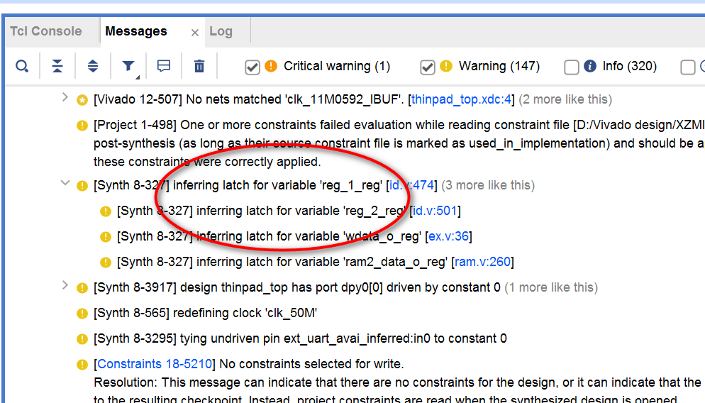

# 调试手册

### 1.注重单指令仿真，认真分析流水线各级的控制信号

最好每一级都添加pc，方便调试，有能力可以移植团体赛golden_trace机制，从而更方便调试，博主并没有移植


### 2.注意阻塞赋值与非阻塞赋值的运用

仅Always(@pos clock)中使用非阻塞赋值，即描述时序逻辑时使用<=;
always（*）/assign语句使用阻塞赋值，即描述组合逻辑使用=。
并且一个always中不能混用非阻塞和阻塞赋值，也就是一个always中要么描述寄存器，要么描述组合逻辑。
博主曾经混用之后使得仿真时从存储器中读出的数据全为高阻态，但上板通过，排查了很久


### 3.避免Latch描述

可以查看vivado的综合结果，如果有Latch就会有警告，类似下图：

​                         

Latch产生的原因一般是if else或者case赋值不完全，解决方法是将各种情况赋值完整，或者在always块开始就给组合逻辑信号一个默认赋值

Latch在FPGA工作可能不稳定，博主曾经因为这个，使得仿真通过但是上板后斐波那契数列前64项输出都正常，但从65项就开始错误，也是排查了很久。


### 4. SRAM时序约束文件

官方提供的约束文件thinpad_top.xdc，没有给输入延迟和输出延迟的约束，而SRAM是异步时序，如果你没有做时序封装，有可能会出现时序紧张导致上板访问SRAM时出现问题，博主已经在约束文件末尾增加了延迟，具体延时时间可以根据自己cpu的上板情况进行微调。

当然最好的方法还是写一个SRAM控制器，对SRAM进行时序封装，也就是将异步SRAM转换为同步控制，具体可以参考龙芯第五次培训东北大学介绍的经验。包括串口也做一个时序封装，串口访问也会更加稳定。


### 5. 单一时钟策略

CPU时钟频率的调整是在Vivado中配置PLL的输出时钟频率。CPU和串口等模块的时钟一般使用PLL输出的clk_out1，复位信号使用异步复位，同步释放之后的复位信号（不能使用reset_btn！！！）。

（在thinpad_top.v文件中调整，博主使用的是clk_59M与reset_of_clk59M信号）


尽量不要做多时钟。如果你的CPU主频可以做到100MHz，但由于官方提供的SRAM最高支持主频只到60MHz左右，那么势必要做跨时钟域的处理，完全没有必要。一个更简单的办法是SRAM也用100MHz时钟，但每次访存时控制信号发两个时钟周期，这样就相当于50MHz的时钟了。


### 6.串口相关问题

仿真串口技巧：串口默认速率9600太慢，仿真时间太长，在仿真时可以将波特率调成和CPU主频相同（具体在RAM_Serial_ctrl.v文件中，在综合布线时别忘了改回来！！！）

串口可能较为难以理解，且博主还添加了FIFO队列优化，因此博主先将未添加FIFO时的各控制信号的意义写在下面。FIFO就是一个先进先出队列，为的就是减少等待时间，请自行对照代码体会添加之后串口控制信号生成不同之处。

```verilog
//串口实例化模块，波特率9600，仿真时可改为59000000
/*
接收模块功能：通过rxd一个bit一个bit地接收数据之后，当接收完8Bit后存储到RxD_data中，并自动置RxD_data_ready为1，说明接收完毕，然后停止接收数据，直到你处理完RxD_data(比如输出之后)手动将RxD_clear信号置1，此信号会自动控制RxD_data_ready变为0，从而可以继续接收数据。
因此你只需控制RxD_clear信号的生成。

发送模块功能：手动将待发送数据存到TxD_data中，当你将TxD_start置为1后，模块开始自动通过txd一个bit一个bit地发送数据，当发送串口在发送数据时，模块自动将TxD_busy信号置为1，发送完毕自动置为0，显然，TxD_busy为1时无法发送新的数据(即此时你不能更改TxD_data)。
因此你需要控制TxD_start和TxD_data信号的生成。
*/
async_receiver #(.ClkFrequency(59000000),.Baud(9600))   //接收模块
                ext_uart_r(
                   .clk(clk),                           //外部时钟信号
                   .RxD(rxd),                           //外部串行信号输入
                   .RxD_data_ready(RxD_data_ready),     //数据接收到标志
                   .RxD_clear(RxD_clear),               //清除接收标志
                   .RxD_data(RxD_data)                  //接收到的一字节数据
                );

async_transmitter #(.ClkFrequency(59000000),.Baud(9600)) //发送模块
                    ext_uart_t(
                      .clk(clk),                        //外部时钟信号
                      .TxD(txd),                        //串行信号输出
                      .TxD_busy(TxD_busy),              //发送器忙状态指示
                      .TxD_start(TxD_start),            //开始发送信号
                      .TxD_data(TxD_data)               //待发送的数据
                    );

```

值得注意的是，串口的接收模块有个RxD_clear信号，需要控制其在RST时复位一下，这样其最开始输出的RxD_data_ready信号就是0而不是X了。可以避免读取串口时将LB指令的接口在寄存器文件中写入X


### 7.提高性能测试得分

第一步是优化时钟频率，不断提高PLL的主频，通过查看Vivado的时序报告，看看关键路径在哪里。想办法优化逻辑缩短关键路径。建议主频至少提高到50MHz。

第二步是优化CPI，例如做完全的数据旁路、增加流水线级数、cache、分支预测（TODO：如果是五级流水线则不需要，因为测试程序都有延迟槽，但如果是七级流水线则需要考虑，否则分支错误流水线损失比较大）、乱序多发射等等。

LW/SW指令访问BASERAM时会导致与IF级的结构冒险，必须对IF进行阻塞。因此，增加icache和dcache会缓解这种冒险，有利于性能提升。

另外竞赛提供BASE RAM和EXT RAM最高支持主频是60MHz左右，如果你的CPU能跑的更快，那么做icache和dcache是必须的。举个例子，比如你的CPU能跑到90MHz，那么cache不命中是要访问BASERAM或EXTRAM，所发出的读写控制信号应该持续两个周期，这样才满足RAM的时序。


### 8.反汇编二进制文件

需要使用大赛提供的资源发布包，因为较大所以没有上传，请自行搜索下载，并添加博主写的add2windows_env文件下内容到响应位置，便于调试，详情请参照README.md。


### 9.其他注意事项

一定要先仿真再上线尝试，仿真时更加容易找问题。

仿真能通过但上板不能通过，一般是时序问题问题。

上板能通过但仿真不能通过，一般是代码规范问题。

所有寄存器建议使用同步复位描述，建议所有寄存器都进行复位。

组合逻辑不应当使用RST信号进行复位，只有寄存器才需要复位，这里博主暂未修改，可以自行改进。

避免多驱动描述，即一个信号只能在一个always中赋值。


最后，**请不要照搬代码**，博主写这些内容是为了方便学弟学妹们少踩坑，尽快投入到优化性能的方向中的。如果你只是为了最后的成绩，耍些改改变量名、改改结构什么的小聪明，而一点努力都不付出的话，我还是请你放弃试点班名额，安安心心考试。当然，CPU设计思想大都是一样的，大家可以看别人的代码，去理解CPU体系结构设计，然后自己画一个CPU流水线结构图，按照设计图自己写代码，最后博采众长，尽快优化性能。博主当时时间有限，也没有添加更好的优化，希望学弟学妹们能实现从模仿到超越！！


### 鸣谢

特别要感谢安建峰老师对我的帮助，本文档也是博主基于安建峰老师整理的内容进行修改得到的，希望能对你有所帮助。

